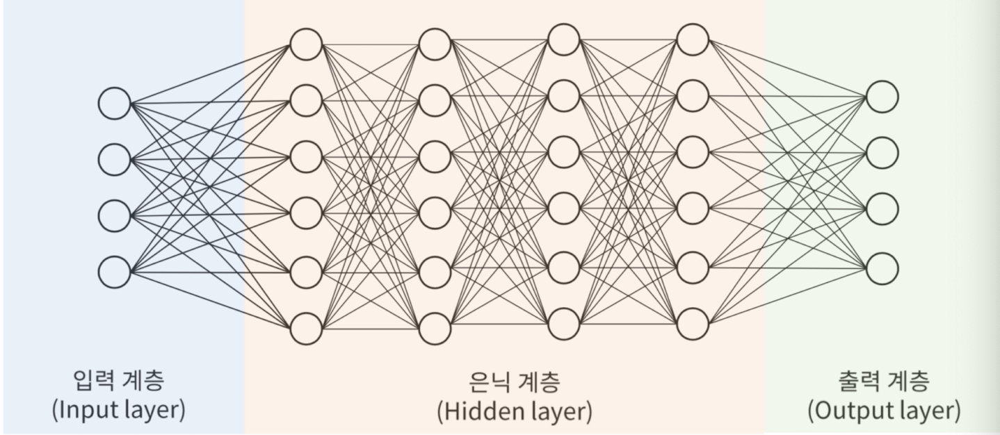

# lecture 0_수학, 통계를 지나 chatgpt까지

`인공지능과 시대적 변화`
- 인공지능의 정의: AI는 인간의 지능을 컴퓨터로 구현하는 기술이며 , 지능적인 기계와 프로그램을 만드는 공학을 의미한다. 

- 산업혁명: 4차 산업혁명은 IoT/CPS/AI를 기반으로 하는 '만물 초지능 혁명'으로, 데이터가 중요한 자원이 되는 시대.

- AI의 발전 배경: 딥러닝의 발전은 빅데이터의 출현 (대량의 데이터 축적) , 컴퓨팅 하드웨어의 개선 (GPU와 클라우드 발전) , 새로운 알고리즘 개발 (ReLU, 배치 정규화 등)

- AI의 역사: AI는 1956년 다트머스 회의에서 개념이 정립되었고 , 이후 IBM 딥블루(1997년)가 체스 챔피언에게 승리하고 , IBM 왓슨(2011년)이 퀴즈쇼에서 우승하는 등 발전을 거듭했다. 2016년에는 알파고가 이세돌에게 승리하며 딥러닝 시대가 시작되었다. 

`머신러닝과 딥러닝`
- 관계: AI는 가장 넓은 개념이고, 머신러닝은 AI를 구현하는 학습 방법임. 딥러닝은 머신러닝의 한 기술로, 데이터의 다층적 표현과 추상화를 통해 학습하는 기법. 

- 학습 방식: 딥러닝은 여러 계층(은닉층)을 통해 입력 데이터의 특징을 단계적으로 학습한다. 예) 이미지 인식 시 첫 번째 은닉층에서는 가장자리를, 두 번째에서는 윤곽선을, 세 번째에서는 눈, 코, 입과 같은 부분을 인식하는 식. 

- 딥러닝의 능력: 딥러닝은 이미지 인식(교통 표지판, 손글씨), 이미지 컬러화, 이미지 합성, 스타일 전달, 이미지 캡션 생성 등의 작업 수행. 

`통계학과 AI`
- 통계의 중요성: 통계는 판단의 착시를 줄이고, 자원 배분의 근거를 제시하며, 불확실한 미래를 예측 가능하게 하고, 공정성과 윤리의 출발점을 제공한다. 

- AI와 통계: AI의 핵심은 '데이터 → 확률 모형 → 추정·예측' 파이프라인이며, 딥러닝 역시 예시를 통해 다음에 나올 것을 확률로 예측하는 기계이다. 

`초거대언어모델(LLM)`
- 자연어 처리: 인간의 언어 현상을 컴퓨터를 이용하여 모사할 수 있도록 연구하고 구현하는 인공지능의 주요 분야

- 언어모델: 문장을 구성하는 단어들이 나타날 확률을 알고 있다면 단어를 선택하거나 문장을 생성해야하는 경우, 여러 후보 단어들 중에서 가장 그럴듯한 단어를 선택할 수 있다.

- LLM: 대용량 연산 인프라를 기반으로 학습하며, 사람처럼 대화하고 질문에 답할 수 있는 모델. 일반적으로 매개변수(가중치)가 1,000억 개를 넘을 경우 초거대 언어모델로 분류한다.

    - ChatGPT: 2022년 11월에 공개된 AI 챗봇으로, 온라인 서비스 중 최단기간에 1억 명의 이용자를 돌파. 

`AI와 일자리`
- AI의 확산으로 계산원, 데이터 입력원과 같은 직업은 감소하지만 , AI 및 머신러닝 전문가, 데이터 분석가, 데이터 과학자 등의 수요는 증가할 것으로 예측하고 있다. 

`AI와의 공존` 
- AI 시대에 대비하기 위해서는 AI 기술을 정확히 이해하고, 업무에 활용할 방법을 끊임없이 고민하며, 분석적 사고, 능동적 학습, 창의성 등 AI에 대체되지 않는 역량을 키워야 한다. 

# lecture 1_딥러닝 개요

`머신러닝(기계학습)`
- 컴퓨터
    - 계산과 논리적 연산의 도구.
    - 문제를 수식화, 논리화해서 규칙으로 만든 후 코딩을 통해 프로세서를 제어해서 그 문제를 해결.
    
- 규칙을 코딩하지 않고 컴퓨터가 학습하여 패턴(규칙)을 찾아내는 방법

- 답이 있는 데이터 학습 -> 숨겨진 패턴 또는 규칙을 찾을 수 있다. (컴퓨터 스스로 학습하여 과제를 수행하는 모형을 만듦)

- 구성
    - 과제(task)
        - 분류: 데이터로부터 주어진 범주 중 하나 또는 여러 개를 선택
        - 회귀: 데이터로부터 수치 예측
        - 예) 암 발병 여부, 숫자 인식, 소득 예측
    - 데이터 
        - 숫자, 이미지, 텍스트, 음성 등 다양한 형태
        - 지도학습: 입력 데이터와 출력 데이터가 같이 수집
        - 비지도 학습, 자기지도 학습: 입력 데이터만 수집
        - 훈련 데이터: 모형 만들 때
        - 시험 데이터: 모형과 성과를 측정할 때
    - 모형
        - 확률 모형: 회귀모형, 로지스틱 회귀모형, 나이브베이즈
        - 알고리즘 모형: 딥러닝 모형
    - 손실함수(loss function)
        - 입력 데이터와 출력 데이터의 차이
        - 분류: 교차 엔트로피
        - 회귀: MSE
    - 최적화 알고리즘
        - 손실함수를 최소로 하는 모형의 모수를 찾는 알고리즘 <- 지속적으로 수정
        - 최소제곱법, 최대가능도추정법, 경사하강법

- 학습 방법
    - 지도학습
    - 비지도학습
    - 준지도학습
    - 자기지도학습
    - 강화학습

`딥러닝`
- 여러가지 신경망
    - 퍼셉트론
    - 다층신경망(MLP): 은닉층 여러개
    - 합성곱신경망(CNN): 이미지 인식 및 식별에 사용. 합성곱필터 이용 -> 다층신경망
    - 순환신경망(RNN): 은닉층이 순환 구조. 순서에 따라 의존성이 있는 데이터. 
    - 오토인코더: 입력층과 출력층이 같아지도록. 비지도 학습.
    - 생성적 적대 신경망(GAN): 입력 이미지 -> 출력 이미지. 비지도 학습.

- 신경망의 작성
1. 입력 데이터 -> 출력, 훈련, 시험 데이터
2. 훈련 데이터를 경사하강법으로 학습
3. 손실함수 계산
4. 신경망의 가중치: 오차역전파법 이용하여 가중치 갱신 

- 은닉층 수가 증가해도 최적의 계수추정이 가능한 기법이 연구되는 중. 

`딥러닝 프레임워크`
- TensorFlow: 분산 환경에 대한 지원, 윈도우나 모바일 환경 등 다양한 디바이스에 포팅 가능. 폭넓은 커뮤니티와 구글 백업.

- Keras: 심각한 작업에는 쓸모 없음. 교육용이면 ok.

- Theano

- Caffe

- Torch

- PyTorch: 매우 빠름. 연구용이라면 나쁘지 않음. 디버깅이 편함. 

- 파이썬

- 아나콘다

- 구글코랩

