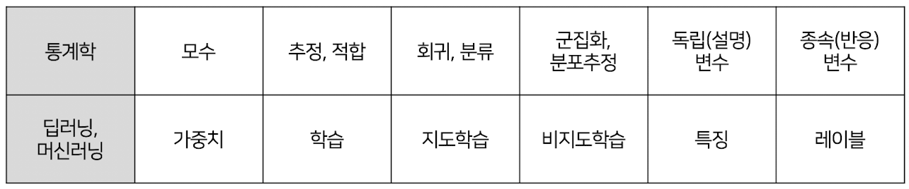
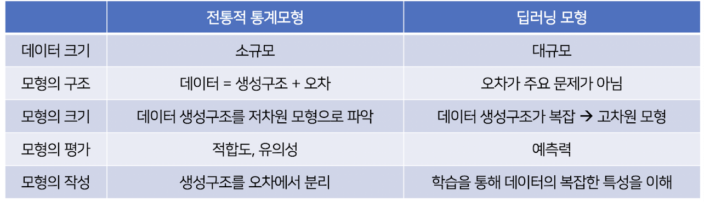
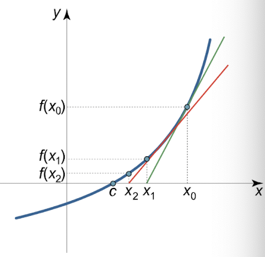
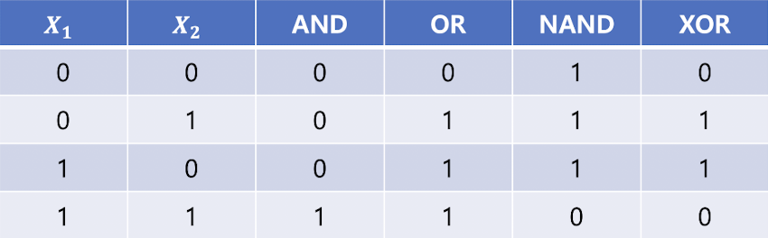
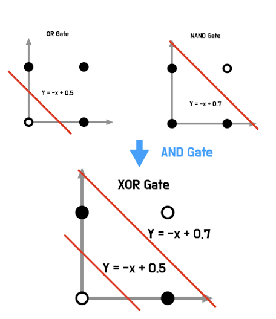
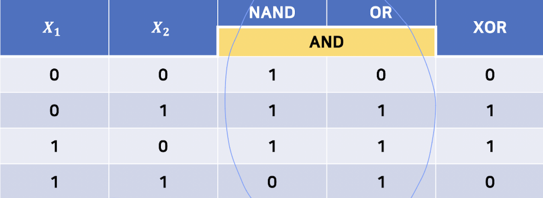

# lecture2_딥러닝과 통계학

## 통계학과 딥러닝
☑️ 통계학
- 데이터를 통해 배우는 과학
- 통계적 추론
- 빅데이터 시대가 되고 컴퓨팅 능력이 향상되면서 수리적 절차 중심 통계학의 체제가 알고리즘 기반으로 변하고 있음
- 알고리즘 기반 추론 = 머신러닝
    - 20c후반, 랜덤포레스트 배깅 부스팅 등의 알고리즘 모형 
    - 
☑️ 딥러닝
- 블랙박스 모형 -> 예측만이 목적 
- 
- 신경망에서 이용되는 확률분포
    - 이산형: 베르누이, 멀티누이
    - 연속형: 정규분포

☑️ 확률과 정보량 
- $I(E)=−log[p(E)]$
    - 확률 0에 가까움 -> 희귀 -> 정보량⬆️
- 확률변수: 표본공간(사건)을 숫자로 바꿔주는 함수
    - 확률분포를 따름
        - 확률질량함수
        - 확률밀도함수

---

☑️ 기댓값 (Expectation)
* **이산형:**
  $[
  E[X] = \sum_{i} x_i f(x_i)
  ]$

* **연속형:**
  $[
  E[X] = \int_{-\infty}^{\infty} x f(x), dx
  ]$

---

☑️ 분산 (Variance)

$[
Var(X) = E\big[(X - \mu)^2\big]
]$

전개하면,

$[
Var(X) = E[X^2] - (E[X])^2
]$

---
☑️ 엔트로피 (Entropy) : 정보량의 기댓값
- 확률변수 (X)의 **평균 정보량**으로, 불확실성을 나타내는 척도

* **이산형 확률변수 (X):**
  $[
  H(X) = E[I(x)] = -\sum_{i} p(x_i) \log p(x_i)
  ]$

* **연속형 확률변수 (X):**
  $[
  H(X) = - \int_{-\infty}^{\infty} f(x) \log f(x) , dx
  ]$

- 엔트로피가 작으면 특정 사건이 발생할 가능성이 높다는 것을 의미

### 베르누이 분포
- 이진분류에 활용
- $H(p)=−[plog​p+(1−p)log​(1−p)]$

### 멀티누이 분포
- 베르누이 분포 확장
- 확률변수가 K개의 범주를 가질 때의 분포
- MNIST 분류과제 또는 원-핫 인코딩에 활용

✔️ 확률변수 정의

$[
P(X_1 = x_1, X_2 = x_2, \ldots, X_K = x_K)
= \prod_{i=1}^{K} p_i^{x_i}, \quad x_i \in {0,1}
]$

여기서 조건은
$[
\sum_{i=1}^{K} p_i = 1, \quad \sum_{i=1}^{K} x_i = 1
]$

---
✔️ Likelihood

$[
L(p) = \prod_{i=1}^{K} p_i^{x_i}
]$

---

✔️ Log-Likelihood 

$[
\ell(p) = \sum_{i=1}^{K} x_i \log p_i
]$

---

✔️ Expected Log-Likelihood

$[
E[-\ell(p)] = - \sum_{i=1}^{K} E(x_i) \log p_i
]$

여기서
$[
E(x_i) = 1 \cdot p_i + 0 \cdot (1 - p_i) = p_i
]$

따라서,
$[
E[-\ell(p)] = - \sum_{i=1}^{K} p_i \log p_i
]$

---

✔️ 엔트로피 (Entropy)

$[
H(p) = - \sum_{i=1}^{K} p_i \log p_i
]$

### 정규분포
✔️ 확률밀도함수 (PDF)

$f(x) = \frac{1}{\sqrt{2\pi\sigma^2}} \exp \left( - \frac{(x - \mu)^2}{2\sigma^2} \right), \quad -\infty < x < \infty$

---

✔️Log-Likelihood

$
\ell(x) = -\frac{1}{2} \log(2\pi\sigma^2) - \frac{(x - \mu)^2}{2\sigma^2}
$

---

✔️엔트로피

$
H(X) = -E[\ell(x)]
$

따라서,

$
H(X) = -E \left[ -\frac{1}{2} \log(2\pi\sigma^2) - \frac{(X - \mu)^2}{2\sigma^2} \right]
$

✔️ 계산 과정

* 첫 번째 항:
  $
  E\left[-\tfrac{1}{2}\log(2\pi\sigma^2)\right] = -\tfrac{1}{2}\log(2\pi\sigma^2)
  $

* 두 번째 항:
  $
  E\left[- \tfrac{(X - \mu)^2}{2\sigma^2}\right] = - \tfrac{1}{2\sigma^2} E[(X - \mu)^2]
  $

여기서 $(E[(X - \mu)^2] = \sigma^2)$ 이므로,

$
E\left[- \tfrac{(X - \mu)^2}{2\sigma^2}\right] = -\tfrac{1}{2}
$

---

✔️최종 결과

$
H(X) = \frac{1}{2} \log (2\pi\sigma^2) + \frac{1}{2}
$

## 퍼셉트론과 아달린
### 퍼셉트론
✔️ 기본 구조

* 입력변수: $ x_0 = 1, x_1, x_2, \ldots, x_p $
* 가중치: $ w_0, w_1, \ldots, w_p $
* 선형 이진 분류기

---

✔️ 출력 함수

입력값들의 가중합을 구한 뒤, 계단함수(step function)를 적용하여 출력 결정:

$
\hat{y} = g\left(\sum_{j=0}^{p} w_j x_j \right) = g(\mathbf{w}^\top \mathbf{x})
$

---
✔️ 활성화 함수 (Activation Function)

퍼셉트론의 활성화 함수 (g(x))는 **계단 함수**로 정의됨:

$
g(x) =
\begin{cases}
1, & x > 0 \
0, & x \leq 0
\end{cases}
$

즉,

* 입력의 가중합이 0보다 크면 $\hat{y} = 1$
* 입력의 가중합이 0보다 작거나 같으면 $\hat{y} = 0$

---

✔️ 퍼셉트론 구조도

* 입력 $(x_1, x_2, \ldots, x_m)$
* 가중합 $(\sum w_j x_j)$
* 활성화 함수 $g(x)$
* 출력 $\hat{y}$
* 오류(Error) 피드백을 통한 학습

---
☑️퍼셉트론 학습 규칙 (Perceptron Learning Rule)

✔️오차 정의

실제값과 출력값의 차이를 **오차(error)**라 정의:

$
e^{(i)} = y^{(i)} - \hat{y}^{(i)}
$

---

✔️가중치 갱신

각 반복(iteration)마다 가중치는 다음과 같이 업데이트 됨:

$
w_j := w_j + \Delta w_j
$

---

✔️가중치 변화량

$
\Delta w_j = \eta , e^{(i)} x_j^{(i)}, \quad j = 0, 1, \ldots, p
$

* $\eta$: 학습률 (learning rate)
* $e^{(i)}$: (i)-번째 데이터의 오차
* $x_j^{(i)}$: (i)-번째 데이터의 입력값

---

✔️특징

* 퍼셉트론은 **손실함수(loss function)**를 명시적으로 정의하지 않고,
  단순히 **오차 기반 규칙**으로 가중치를 갱신.

### 아달린(Adaptive Linear Neuron)
- 퍼셉트론의 문제점: 손실함수를 정의하지 않고 가중치를 갱신하여 일반적 과제를 해결하는 데 부적합함.
* 퍼셉트론과 유사하지만, **선형 활성화 함수**를 사용:
  $
  \sigma(z) = z
  $
* 따라서 가중치 갱신 방식은 퍼셉트론과 다르게 **연속적인 오차**를 기반으로 함.

---

✔️손실 함수 (Loss Function)

**최소제곱법 (Widrow-Hoff rule)**을 사용하여 손실 함수를 정의:

$
J(w) = \frac{1}{2} \sum_i \Big( y^{(i)} - \sigma(z^{(i)}) \Big)^2
$

여기서,
$
z^{(i)} = \sum_{j=0}^{p} w_j x_j^{(i)}
$

---

✔️가중치 갱신 규칙

경사하강법(Gradient Descent)을 사용하여 가중치를 갱신:

$
w_j := w_j + \Delta w_j
$

$
\Delta w_j = \eta , e^{(i)} x_j^{(i)}, \quad j = 0, 1, \ldots, p
$

* $\eta$: 학습률 (learning rate)
* $e^{(i)} = y^{(i)} - \sigma(z^{(i)})$: 연속형 오차

---

✔️ 퍼셉트론과 비교

* **아달린(Adaline):** 오차가 **연속적** $(e^{(i)} = y^{(i)} - z^{(i)})$
* **퍼셉트론(Perceptron):** 오차가 **이산적** $(e^{(i)} = y^{(i)} - \hat{y}^{(i)})$

---

## 선형 회귀모형

$$
y_i = w_0 + w_1 x_i + \varepsilon_i , \varepsilon_i \sim N(0, \sigma^2)
$$

* $y_i$: 종속변수 (반응변수, output)
* $x_i$: 독립변수 (설명변수, input)
* $w_0$: 절편 (intercept)
* $w_1$: 기울기 (slope, 회귀계수)
* $\varepsilon_i$: 오차항 (error term)

- 추정방법
    - 최소제곱법
    - 최대가능도추정법

☑️최소제곱법(LSE)

✔️목적함수 (MSE)

잔차제곱합(SSE)을 최소화하기 위해, 평균제곱오차(MSE)를 정의:

$$
J(w) = \frac{1}{2n} \sum_{i=1}^{n} \left( y_i - w_0 - w_1 x_i \right)^2
$$

---

✔️정규방정식 (Normal Equations)

$w_0, w_1$에 대해 각각 미분:

$$
\frac{\partial J(w)}{\partial w_0} = -\frac{1}{n} \sum_{i=1}^{n} (y_i - w_0 - w_1 x_i) = 0
$$

$$
\frac{\partial J(w)}{\partial w_1} = -\sum_{i=1}^{n} (y_i - w_0 - w_1 x_i)x_i = 0
$$

---

✔️추정량 (Estimators)

이를 풀면, 다음과 같은 최소제곱추정량(LSE)을 얻음:

$$
\hat{w}_1 = \frac{\sum (x_i - \bar{x})(y_i - \bar{y})}{\sum (x_i - \bar{x})^2}
$$

$$
\hat{w}_0 = \bar{y} - \hat{w}_1 \bar{x}
$$

☑️최대가능도추정법(MLE)(-> 모수 추정)

✔️ 가능도 함수 (Likelihood Function)

$$
L(w) = \prod_{i=1}^{n} \frac{1}{\sqrt{2\pi\sigma^2}}
\exp \left[ - \frac{(y_i - w_0 - w_1 x_i)^2}{2\sigma^2} \right]
$$

이를 정리하면,

$$
L(w) = \left( \frac{1}{\sqrt{2\pi\sigma^2}} \right)^n
\exp \left[ - \frac{1}{2\sigma^2} \sum_{i=1}^{n} (y_i - w_0 - w_1 x_i)^2 \right]
$$

---

✔️ 로그 가능도 함수 (Log-Likelihood)

$$
\ell(w) = \log L(w)
= -\frac{n}{2} \log (2\pi\sigma^2)

* \frac{1}{2\sigma^2} \sum_{i=1}^{n} (y_i - w_0 - w_1 x_i)^2
  $$

---

✔️ MLE의 해

* $\ell(w)$ 를 최대화하는 것은
  $$
  \sum_{i=1}^{n} (y_i - w_0 - w_1 x_i)^2
  $$
  를 **최소화하는 것**과 동일.

즉, **최대가능도추정법(MLE)**과 **최소제곱법(LSE)**은 같은 추정량을 준다.

---

선형회귀에서 오차항이 정규분포를 따른다고 가정하면,
**MLE = LSE**

☑️신경망 표현

$$
\hat{y} = g\left( \sum_{j=0}^{p} w_j x_j \right) = g(\mathbf{w}^\top \mathbf{x})
$$

* $x_j$: 입력값 (입력 변수)
* $w_j$: 가중치 (weight)
* $g(\cdot)$: 활성화 함수 (activation function)

---

✔️선형 신경망 (Linear Neural Network)

* $g(x)$가 **항등함수(identity function)**일 경우:
  $$
  g(x) = x
  $$
  즉, 출력은 단순히 가중합 형태가 됨.

---

✔️학습 방식

* 미분을 통해 가중치의 최적값을 구할 수 있음 → 알고리즘 방식으로 따로 구하지 않아도 됨
* 하지만 실제로는 **경사하강법(Gradient Descent)** 같은 알고리즘을 사용하여 가중치를 반복적으로 갱신 가능
* 두 방식 모두 동일한 결과(최적 가중치)에 도달

## 최적화방법
### 뉴턴의 방법

1. 기본 아이디어

* 함수 $g(x)$의 미분이 0이 되는 값을 찾는 방법.
* 즉, $f(x) = g'(x) = 0$ 을 만족하는 $x$를 찾음.

---

2. 갱신식 (Update Rule)

$$
x := x - \frac{f(x)}{f'(x)}
$$

---

3. 절차

1. 초기 설정값 $x_0$의 함수값 $f(x_0)$에서 접선을 긋는다.
2. 그 접선이 $x$축과 만나는 점을 $x_1$이라 하고, $f(x_1)$에서 다시 접선을 긋는다.
3. 이를 반복하여 $x_2, x_3, \ldots$ 순으로 점근적으로 해에 수렴한다.

---

4. 최적화에서의 활용

손실함수 $J(w)$가 2차 미분 가능할 때, 뉴턴 방법으로 $J(w)$를 최소화하는 $w$를 구할 수 있다.

갱신식:
$$
w := w - \frac{J'(w)}{J''(w)}
$$

---

5. 특징

* 계산량이 적고 학습률(learning rate) 불필요
* 손실함수가 2차 미분 가능한 매끈한 함수여야 함
* 변수 개수가 작을 때 효과적
* 변수 개수가 많으면, Hessian(이계도함수 행렬) 계산 때문에 비용이 커짐

### 경사하강법

- 함수가 1차 미분은 가능하지만 복잡한 모양을 가지는 경우
- 손실함수가 최소가 되도록 손실함수를 줄이는 **경사(기울기)를 따라 조금씩 가중치 갱신**
1. 테일러 전개

손실함수 $J(w)$를 $w - \eta \Delta w$ 근처에서 테일러 전개하면:

$$
J(w - \eta \Delta w)
= J(w) - J'(w)\eta \Delta w

* \tfrac{1}{2} J''(w) \eta^2 (\Delta w)^2

- \tfrac{1}{3!} J'''(w) \eta^3 (\Delta w)^3 + \cdots
  $$

---

2. 근사

고차항을 무시하면:

$$
J(w - \eta \Delta w) \approx J(w) - J'(w)\eta \Delta w + O(\eta^2 (\Delta w)^2)
$$

---

3. $\Delta w = J'(w)$ 대입

$$
J(w - \eta J'(w)) \approx J(w) - \eta (J'(w))^2 + O(\eta^2 (J'(w))^2)
$$

여기서 $(J'(w))^2 \geq 0$, $\eta^2$는 매우 작으므로:

$$
J(w - \eta J'(w)) \leq J(w)
$$

즉, 갱신하면 손실함수가 줄어듦.

---

4. 최종 갱신식

따라서, 경사하강법의 가중치 갱신 규칙은:

$$
w := w - \eta \frac{\partial}{\partial w} J(w)
$$

* $\eta$: 학습률 (learning rate)
* $\frac{\partial}{\partial w} J(w)$: 손실함수의 기울기

---

5. 직관적 의미

* $J(w)$는 **기울기 방향으로 가장 크게 증가**
* 따라서 $-\nabla J(w)$ 방향으로 갱신하면 손실이 줄어듦
* 학습률 $\eta$가 너무 크면 발산, 너무 작으면 수렴이 느림
* 시작점이 있다면 그 점의 경사(기울기)의 반대 방향으로 움직이면 최저점이 나올 것

---
6. 단점
* 손실함수가 볼록함수가 아닌 복잡한 형태라면 global minimum으로 가지 못하고 local minimum에 머물러 있을 가능성이 큼
    - 데이터의 일부를 임의로 이용하는 것이 더 유용함(미니배치 경사하강법)
* 초기값을 잘못 정하는 경우 손실함수의 global minimum 으로 가지 못하거나 시간이 지나치게 길어질 수 있음
* 학습률 ($\eta$)를 적절히 정해야 함
    - 처음에는 크게, 다음에는 작게 조정하여 수렴속도 빠르게

### 확률적 경사하강법(Stochastic Gradient Decent)
- 데이터를 무작위로 섞은 후 임의로 한 개 선택 -> 기울기 구함 -> 가중치 갱신
- 시작점이 임의로 바뀌므로 local minimum에 머무를 가능성 낮아짐
- 데이터 수가 매우 클 때 학습시간 길어짐

### 미니배치(mini batch) 경사하강법
- 일부 데이터 이용
- batch size -> 기울기 구함 -> 가중치 갱신
- 훈련 데이터 전체를 한 번 학습하는 것 -> **에포크(epoch)**
    - 에포크 수 = 전체 데이터를 학습한 횟수
- 전체 훈련 데이터를 몇 개로 나눈 것 -> 배치 (batch)

## 로지스틱 회귀모형과 소프트맥스 회귀모형
### 로지스틱 회귀모형

1. 활성화 함수 : 시그모이드 함수

$$
g(x) = \frac{1}{1 + e^{-x}}
$$

---

2. 모형식

선형결합 $\sum_{j=0}^p w_j x_j$를 시그모이드 함수에 통과시켜 확률로 변환:

$$
\pi(x) = g\left( \sum_{j=0}^p w_j x_j \right) = g(\mathbf{w}^\top \mathbf{x})
= \frac{1}{1 + \exp\left(- \sum_{j=0}^p w_j x_j \right)}
$$

* $\pi(x) = P(y=1|x)$

예측값:
$$
\hat{y} =
\begin{cases}
1, & \pi(x) \geq 0.5 \
0, & \pi(x) < 0.5
\end{cases}
$$

---

3. 확률모형

$$
y_i \sim \text{Bernoulli}(\pi_i), \quad \pi_i = \pi(x_i)
$$

조건부 확률:
$$
p(y_i|x_i, w) = \pi(x_i)^{y_i} (1-\pi(x_i))^{1-y_i}, \quad y_i \in {0,1}
$$

---

4. 가능도 함수

$$
L(w) = \prod_{i=1}^n \pi(x_i)^{y_i} (1-\pi(x_i))^{1-y_i}
$$

---

5. 로그 가능도 함수

$$
\ell(w) = \log L(w)
= \sum_{i=1}^n \Big[ y_i \log(\pi_i) + (1-y_i)\log(1-\pi_i) \Big]
$$

---

6. 손실 함수 (Cross-Entropy Loss)

$$
J(w) = -\ell(w)
= - \sum_{i=1}^n \Big[ y_i \log(\pi_i) + (1-y_i)\log(1-\pi_i) \Big]
$$

---

7. 시그모이드 미분

$$
\pi_i = \frac{1}{1+\exp(-\sum_{l=0}^p w_l x_{il})}
$$

미분하면:
$$
\frac{\partial \pi_i}{\partial w_j} = \pi_i (1-\pi_i) x_{ij}
$$

---

8. 손실함수의 기울기

$$
\frac{\partial J(w)}{\partial w_j}
= \sum_{i=1}^n (y_i - \pi_i)x_{ij}
$$

---

9. 경사하강법 (Gradient Descent) 갱신식

$$
w_j := w_j - \eta \frac{\partial J(w)}{\partial w_j}
$$

대입하면:
$$
w_j := w_j + \eta \sum_{i=1}^n (y_i - \pi_i)x_{ij}
$$

* $\eta$: 학습률 (learning rate)
* $(y_i - \pi_i)$: 오차 (실제값 - 예측확률)

---

✔️요약

* **모형:** 로지스틱 회귀는 시그모이드 함수를 통해 확률을 추정한다.
* **추정:** 최대우도추정(MLE)을 사용 → 로그가능도 함수 최대화 = 손실함수 최소화.
* **학습:** 경사하강법(Gradient Descent)으로 가중치를 갱신한다.
* **핵심 식:**
  $$
  w_j := w_j + \eta \sum_{i=1}^n (y_i - \pi_i)x_{ij}
  $$

### 소프트맥스(softmax) 회귀모형
 1. 소프트맥스 함수 (Softmax Function)

입력 벡터 $\mathbf{x}_i$와 클래스 $k$에 대한 가중치 벡터 $\mathbf{w}^k$가 있을 때,
클래스 $k$에 속할 확률은:

$$
P(y_i = k \mid \mathbf{x}_i) = \pi_i^k
= \frac{\exp(\mathbf{w}^k \cdot \mathbf{x}*i)}{\sum*{l=1}^K \exp(\mathbf{w}^l \cdot \mathbf{x}_i)}
$$

* $K$: 클래스 개수
* $\pi_i^k$: 샘플 $i$가 클래스 $k$일 확률
* $\sum_{k=1}^K \pi_i^k = 1$

---

2. 손실 함수 (Cross-Entropy Loss)

실제 레이블 $y_i \in {1,2,\dots,K}$를 원-핫 벡터로 나타내면
$y_i^k = 1$ if $y_i = k$, else $0$.

손실 함수는:

$$
J(\mathbf{W}) = -\sum_{i=1}^n \sum_{k=1}^K y_i^k \log \pi_i^k
$$

* $n$: 데이터 개수
* $\mathbf{W} = { \mathbf{w}^1, \dots, \mathbf{w}^K }$

---

3. 기울기 (Gradient)

클래스 $k$의 가중치 $\mathbf{w}^k$에 대해 미분하면:

$$
\frac{\partial J(\mathbf{W})}{\partial \mathbf{w}^k}
= - \sum_{i=1}^n (y_i^k - \pi_i^k)\mathbf{x}_i
$$

---

4. 경사하강법 (Gradient Descent) 갱신식

$$
\mathbf{w}^k := \mathbf{w}^k - \eta \frac{\partial J(\mathbf{W})}{\partial \mathbf{w}^k}
$$

즉,

$$
\mathbf{w}^k := \mathbf{w}^k + \eta \sum_{i=1}^n (y_i^k - \pi_i^k)\mathbf{x}_i
$$

* $\eta$: 학습률 (learning rate)
* $(y_i^k - \pi_i^k)$: 실제값과 예측확률의 차이

---

5. 요약 비교표

| 출력변수       | 확률분포               | 활성화 함수 | 손실 함수        |
| ---------- | ------------------ | ------ | ------------ |
| 이산형 (2클래스) | 베르누이               | 시그모이드  | 이진 크로스 엔트로피  |
| 이산형 (다클래스) | 다항분포 (Multinoulli) | 소프트맥스  | 교차 엔트로피      |
| 연속형        | 정규분포               | 선형     | 평균제곱오차 (MSE) |

## XOR 문제와 다층신경망

---
- 퍼셉트론으로는 비선형 문제를 풀기 어렵다는 것을 의미함 
- 다층신경망으로 이를 해결 -> 은닉층이 필요함을 의미

